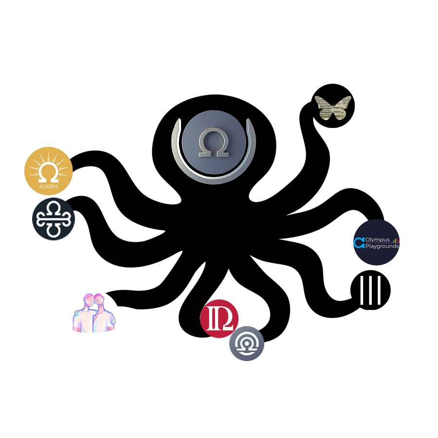
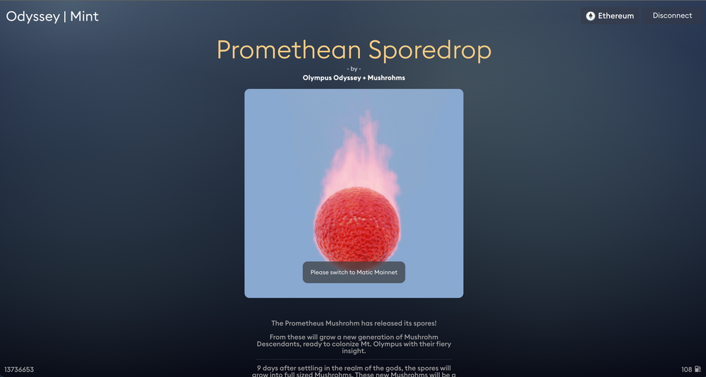
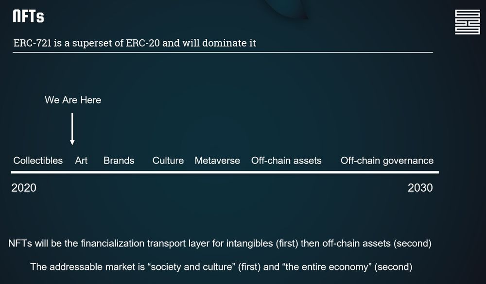

# Best adventure is shared adventure (⚓️,⚓️ )

GM to all the Innovatoooors, the crazy ones, the misfits, the rebels, the troublemakers, the round pegs in the square holes… the ones who see things differently like ZEUS & all the ohmies embracing our (⚓️,⚓️) culture. Every revolutionary and innovator looks naive before proving most wrong. You know it’s crazy early, when even people in crypto don’t get OHM yet. We shared our [strong conviction in April 2021](https://twitter.com/livethelifetv/status/1384090249299521538). Being called out for ponzi is no fun, but it kept us sharp and motivated to research, read, write, and document our journey. You know you're building on the frontier if you’re excited as fuck, scared shitless, no idea what the future holds, but extremely passionate & motivated all at the same time.

# Probably nothing
Mt Olympus is hard to understand and climb but once you make summit, the view is unbelievably clear. Crazy how ohmies might end up becoming the first decentralised Venture Capital DAO because the early stage cohort partners of today are the top 100 coins that OHM has ownership in tomorrow. Soon OHM will have a stake in every protocol that matters. Probably something TBH.

---
### [He who rises with the wave is not swallowed by it*. Olympus DAO](https://livethelife.tv/olympus-dao/)

Staking rewards on OHM tokens are a part of the current growth phase of the protocol, are used to drive users to grow the total amount of OHM they hold. This is counter to hoping tokens appreciate in value. The perfect currency holds the same purchasing power today as in 50 years.

> LiveTheLifeTV - Good Vibes OhmlyGoodVibesOhmly

---

# From unicorn to whale to octopus
As Olympus grows to immense scale and absorbs the utility, liquidity, and culture of its entire ecosystem, it will serve as the central node of a vast network in which value efficiently, frictionlessly, and purposefully travels throughout its habitat. In the context of DeFI, a giant treasury can only do so much. There's nothing innovative about a giant whale. But add in DAO governance focused on strong monetary policy, efficient capital deployment, creatively applying composability and emphasis on the community? Now we're talking. It's clear that OlympusDAO is building an ecosystem. Using Olympus Pro to build partnerships & cohorts, and the launch of Olympus Incubator to back & build innovative projects. We're still so fricking early.

.

> In this season zero, we examine how we can celebrate and cultivate the cultural and financial revolution. (⚓️,⚓️ )

# Art is the frontend, Defi is the backend

An ERC20 token is a standard used for creating and issuing smart contracts on the Ethereum blockchain. Smart contracts can then be used to create smart property or tokenized assets that people can invest in. ERC stands for "Ethereum request for comment". Plenty of well-known digital currencies use the ERC-20 standard, including Olympus DAO. ERC 20 opened the financial system, ERC 721 opened the cultural system. Our vision is that NFTs (ERC-721) will onboard the next billion people on Defi. I bet the DAO would vote in favor of the treasury collecting NFTs. We need an OlympusDAO museum! Meet Olympus Odyssey!!! If Olympus DAO is New York City, Odyssey DAO is the MoMa. It attracts people to the world's best city and curates the finest artists who represent the quality of Olympus culture. We aim to spotlight upcoming artists and give them an incentive to want to work within our culture while spotlighting the loyalty of Olympus members so that their trust in each other be celebrated.

.

# Why shouldn't POL also apply to NFTs?
The NFT market cap is over $7 billion and exponentially growing. Imagine an NFTX-like marketplace powered by OHM. OlympusDAO is an economic experiment using game theory principles to solve major issues in DeFi. If successful, OHM could really become the default reserve currency of the metaverse. Our vision: Cool NFT's with magic Defi mechanics. What Defi needs, to be cool, is gamification. Brands & Culture to move around in the Metaverse, so we can all enjoy off-chain assets (don't miss the IRL boat). When that happens, the sky is the limit.

.

# The next 1M users to OHM

Imagine. Polygon Deployed Fiat on-Ramps via Alchemy Pay. Yep, it's here now. Order your MoverDAO debit card and go from cash to OHM and backward in all of Europe. We're currently brainstorming about a mobile app in @wagmilabsinc hackathon! It will drive adoption, as fiat on and off-ramps are still a huge pain point. The leading NFT platform OpenSea has around half a million users, the leading on/off ramp app, CoinBase, has around half a billion users. They are launching an NFT platform, Olympus Odyssey has been buidling one for the past 6 months, WAGMI.

