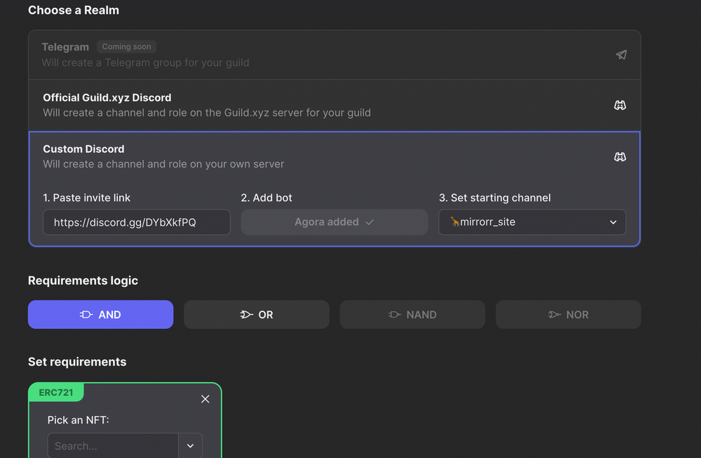
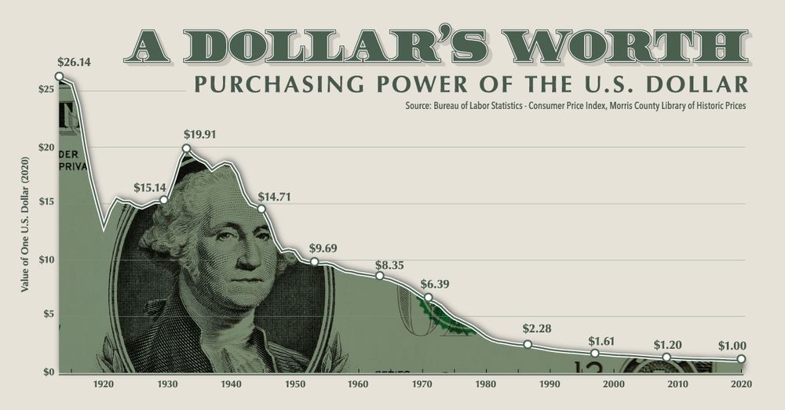

# GameChanger

It’s been called a Ponzi scheme by doubters, a liquidity blackhole by analysts, and a potential future reserve asset by the team behind it. OlympusDAO, with its heavy meme culture, strong community, and innovative tokenomics, has taken the cryptocurrency industry by storm this year. This is more like Bitcoin than you probably realize. Unlimited supply does not have to mean any scarcity. (gitbook)

# Cross-Chain LFG

sOHM is staked OHM. gOHM is wrapped sOHM. You will earn rebase rewards with gOHM across different chains without having to do anything else. gOHM: The non-rebasing wrapper is used to package up staked OHM in a non-rebasing container that can be transferred between chains. gOHM is the first step to V2 migration when $OHM goes fully cross-chain. This innovative idea by ZEUS allows users to hold staked $OHM on other chains without having to pay fees or need to use the Olympus app to do anything. The only fee they would pay is to swap it on a DEX. gOHM is ready and you can start wrapping your $sOHM. If you hold wsOHM on Avax you can now convert it to gOHM on OlympusDAO. With gOHM (governance OHM) out, that means that on-chain governance is right around the corner. Proteus is the rapid bootstrapping of liquidity on other chains with 120k OHM (~$100m) through a cross-chain incentives program.

# Discord fatigue
Anyone else getting discord fatigue? That shit is getting overwhelming. Definitely a great tool. But wow it’s a lot. So much going on at all times! Hard to stay on top of it all for months on end. So we will try hard to filter out the noise and only keep relevant channels unlocked ser. And, add utility to NFT's. The server has been up and running for 18 months now and we started flirting with dunbar's number.

----
### [Joining uninvited for a drink? <50!](https://livethelife.tv/joining-uninvited-for-a-drink/)

Dunbar explained it informally as “the number of people you would not feel embarrassed about joining uninvited for a drink if you happened to bump into them in a bar. It has been proposed to lie between 100 and 250, with a commonly used value of 150. 50 sounds like magic

> LiveTheLifeTV - Good Vibes OhmlyLiveTheLifeTV

----

.

# Token curated channels

True multi-chain support for creating channels in Discord is now a reality thanks to guildXYZ. Ethereum, Polygon, Avalanche,  xDai, Fantom, Arbitrum, and Harmony are all supported on GuildXYZ!!! Projects like Good Vibes Ohmly, yep that's all of us, aka GVO, can now create token curated channels where users can hold NFTs on Polygon while their tokens are in their Ethereum wallet. Now all we need is marketing?

----
### [Earned media beats paid ads](https://livethelife.tv/earned-media/)

If you do have to do something promotional, do something unconventional. Publicity stunts, atypical ads, being the first at something. Be noteworthy and contrarian because earned media beats out paid ads, and its way more fun!

> LiveTheLifeTV - Good Vibes OhmlyLiveTheLifeTV
----

# Open IP is such an interesting concept.

For years, companies have spent probably billions of dollars to protect their IP. What if we flip the script and see people making derivatives of IP as an opportunity for free advertising? Why would you ever sell your Ape when you can earn BAYC tokens passively AND probably license out the IP? If you invest in stocks and think NFT’s are stupid, think of it like this. Imagine a company like BoredApeYC that made half a billion dollars in profit in its initial 6 months of going public, we would call that a unicorn in the biz world. $1.3 billion in combined secondary trading volume across all collections since launching in April. Instead of a stock tho, you own art. Your art is in a superstate where it constantly fluctuates between art, proof of ownership, access keys, items (physical and digital), and perceived values. It’s ok to collect NFTs for different reasons, whether it’s the art, the money, the tech, or the membership.

.